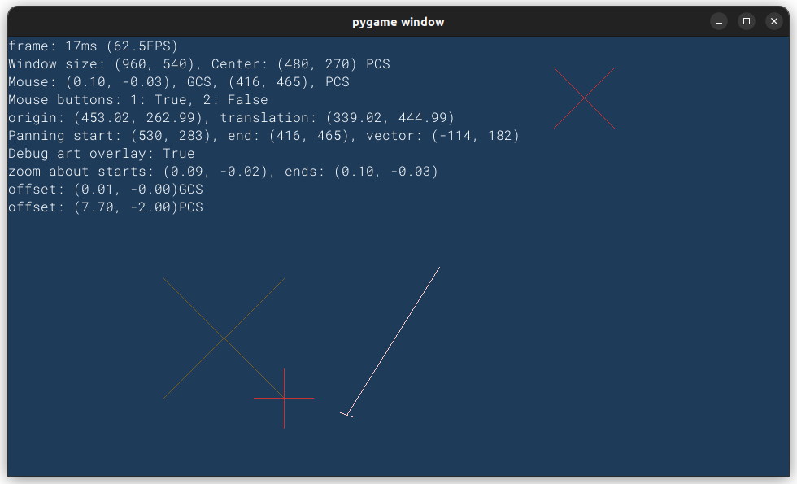

# About

Use pygame to create an application.

Folder `engine` is my 2D engine Python package. `game.py` is a starting point
for writing a Game in the `game.py` file.

# Setup

## Virtual environment

Create a virtual environment:

```
$ python3 -m venv ~/pydev
```

Create an alias to make it easy to activate the virtual environment:

```bash
alias pydev=". $HOME/pydev/bin/activate"
```

Activate the virtual environment:

```
$ pydev
(pydev) $
```

## pip install

Install `pygame-ce` (for talking to the OS).

```
(pydev) $ pip install pygame-ce
```

Then launch the application:

```
(pydev) $ make run
```

This does:

```
(pydev) $ ./main.py
```

During development, I alter the `run` recipe to put the window at upper right:

```
(pydev) $ SDL_VIDEO_WINDOW_POS="950,0" ./main.py
```



- Mouse wheel zoom/pan
- `q`: Quit
- `c`: Clear debug snapshot artwork
- `Space`: Toggle debug art overlay
- `d`: Toggle debug hud
- `Ctrl_+`: Increase debug HUD font
- `Ctrl_-`: Decrease debug HUD font
- Resize the window with a mouse click-drag

## Optional setup

- Install `pytest` to run the doctests.
- Install the linters `pycodestyle`, `pylint`, and `mypy`.

### Unit tests

Install `pytest` (to run the doctests):

```
(pydev) $ pip install pytest
```

Run the tests:

```
(pydev) $ make tests
```

This does:

```
(pydev) $ pytest --doctest-modules --verbose
```

### Linters

Install `pycodestyle`:

```
(pydev) $ pip install pycodestyle
```

Test pycodestyle:

```
(pydev) $ pycodestyle --max-line-length=100 .
```

Install `pylint` and `mypy`:

```
(pydev) $ pip install pylint
(pydev) $ pip install mypy
```

*Note: `pylint` and `mypy` come with `Python`, but these versions are out of
date and will cause errors.*

- Run the above `pip install` to get the updated versions. (This also updates
  several other packages.)
- Close and reopen the shell for these changes to take effect (otherwise you
  will get mystery linting errors).
- *Remember to reactivate your virtual environment after opening a new shell!*

Test `pylint`:

```
(pydev) $ pylint .
```

**Note**: you need to have already installed either `pygame` or `pygame-ce`,
otherwise you will get this error:

```
game.py:65:0: E0401: Unable to import 'pygame' (import-error)
```

Test `mypy`:

```
$ mypy --strict .
```

If all of the above are running without error, you have everything set up correctly.

Run the linters using the Makefile recipe:

```
$ make lint
```

This does:

```
$ pycodestyle --max-line-length=100 .
$ pylint .
$ mypy --strict .
$ flake8 --max-complexity 10 --max-line-length 100 --extend-ignore F821 .
```

# Why

This started out from a desire to make a plotting application. See
private repo https://github.com/theendofeverything/pygame-kata-2025_11_17.

It ended up being my first time implementing coordinate transforms where I felt
I really understood all of the underlying math. So I decided to keep going on
the graphics engine part.

# Roadmap

I started out only doing 2D graphics, but now that I understand the math, I
realize it isn't a big leap to turn this into a 3D engine.

I have a basic UI to build on top of. Now I am working on getting more graphics
onto the screen.

# Math

The coordinate transforms use matrices as the transform operators. The matrix
dimensions are one larger than the number of spatial dimensions to use
homogeneous coordinates for translation. See
[doc/coordinate_transforms.md](doc/coordinate_transforms.md).

# Python code

## Engine structure

The Python project follows a simple structure. The project is essentially flat
with an entry point in `main.py`, the game in `game.py`, and all engine code
residing in the `engine/` folder.

For now, I am re-using the engine code in other projects by making symbolic
links. This is handled by `setup.sh` which copies the files from a local clone
of `engine_2025` into my project. In the tree illustration below, files that
copy in as symbolic links are marked with an asterisk (`*`).

```
.
├── doc/ <--------------------- make this yourself (specific to the project)
├── *engine/ (package) -> ../engine_2025/engine
│   │
│   │   ---Documentation---
│   ├── *README.md <------------ ENGINE README
│   ├── *doc/ <----------------- ENGINE DOCS
│   │   ├── *img/
│   │   │... *(docs)
│   │   └── ...
│   │
│   │   ---Package Modules---
│   ├── *__init__.py <---------- MAKES engine A PACKAGE
│   │... *(modules)
│   └── ...
├── fonts/ <------------------- (folder is not a sybmolic link, add fonts as needed)
│   └── *ProggyClean.ttf <----- (used by engine for debug HUD)
├── game.py <------------------ TOP LEVEL GAME CODE (the only editable file)
├── *main.py <----------------- ENTRY POINT
├── *Makefile <---------------- RECIPES FOR RUNNING, LINTING, TESTING, AND TAGGING
├── *.mypy.ini <--------------- LINTING CONFIGURATION
├── *.pylintrc <--------------- LINTING CONFIGURATION
├── *.pytest.ini <------------- TESTING CONFIGURATION
├── README.md <---------------- make this yourself (specific to the project)
└── *setup.sh <---------------- SET UP SCRIPT TO CREATE ALL OF THE ABOVE
```

The `engine/__init__.py` makes the `engine/` folder a Python package.

*Note: Python runs the application just fine without this `__init__.py`. The
`__init__.py` is only necessary to avoid linter `mypy` throwing the error
`Cannot find implementation or library stub for module named ...`.*

## Use engine for a game

My quick and dirty way to use the engine is to create symbolic links. I know
engine will change as I develop game code and rather than deal with git
submodules, I am just going to use symbolic links and update the git repos
separately.

I clone `engine_2025`. Then I make a new folder, I make a link to `setup.sh` in
my new folder and run the `setup.sh`:

```
$ mkdir my_project && cd my_project
$ ln -rs ../engine_2025/setup.sh .
$ ./setup.sh
```

This results in the following project structure for my game. In the following
tree illustration, symbolic links are indicated with `->` (followed by the
local file they link to).

```
.
├── doc
├── engine -> ../engine_2025/engine
├── fonts
│   └── ProggyClean.ttf -> ../../engine_2025/fonts/ProggyClean.ttf
├── game.py
├── main.py -> ../engine_2025/main.py
├── Makefile -> ../engine_2025/Makefile
├── .mypy.ini -> ../engine_2025/.mypy.ini
├── .pylintrc -> ../engine_2025/.pylintrc
├── .pytest.ini -> ../engine_2025/.pytest.ini
├── README.md
└── setup.sh -> ../engine_2025/setup.sh
```

`game.py` is the starting point -- the `setup.sh` copies this to
`game.py` in the project (rather than making a symbolic link). If you rename
this file to something other than `game.py`:

- make a local copy of `main.py` and delete the symbolic link
- edit the module name in `main.py` to import `Game` from the new name

```python
# main.py
from game import Game
```

## Engine contents

Many of the `engine/` files are Python modules that define a single
class. Some modules define additional classes, but the API is in the one class
the file is named after.

File                  | Class
----                  | -----
`engine/art.py`       | `Art`
`engine/colors.py`    | `Colors`
`engine/coord_sys.py` | `CoordinateSystem`
`engine/debug.py`     | `Debug`
`engine/panning.py`   | `Panning`
`engine/renderer.py`  | `Renderer`
`engine/timing.py`    | `Timing`
`engine/ui.py`        | `UI`

The other engine files define multiple classes used in the application:

File                           | Classes
----                           | -------
`engine/drawing_shapes.py`     | `Line2D`, `Cross`
`engine/geometry_operators.py` | `Matrix2D`, `Matrix2DH`, `Matrix3D`
`engine/geometry_types.py`     | `Point2D`, `Vec2D`, `Vec2DH`, `Vec3D`
`log.py`                       | No class, just function `setup_logging()`

The root-folder contains a `main.py` and `game.py`. The `game.py` is just a
starting point for writing your actual `game.py`.

`main.py` is not specific to any game. It just sets up logging, registers a
`shutdown()` function for cleanup on exit, and launches the game code.

Class `Game` contains the top-level game code. It is instantiated in `main.py`
where `Game().run()` launches the application.

# Docs in `doc`

These docs are context for future me to remember the workflow, house-keeping
miscellany of developing a Python project.

- [Coordinate transform math](doc/coordinate_transforms.md)
- [Dataclasses](doc/dataclasses.md)
- [Python str format specifiers](doc/format_specifiers.md)
- [Python pattern matching](doc/pattern_matching.md)
- [Pygame docs](doc/pygame_docs.md)
- [Python linters](doc/python_linters.md)
- [Type hints](doc/type_hints.md)
- [Unit Tests](doc/unit_tests.md)
- [Vim](doc/vim.md)
